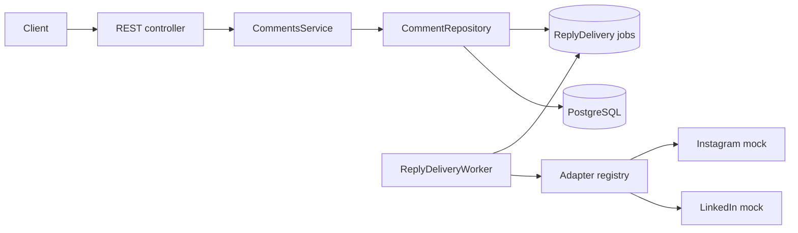

# CommentBridge

CommentBridge is a TypeScript/NestJS REST API that reads normalized comments for
a logical social-media post and sends replies through platform adapters. It covers
multi-publication reads, stable cursor pagination, parent-scoped idempotency,
delivery lifecycle tracking, RFC 7807 errors, Swagger, PostgreSQL tests, and
deterministic Instagram and LinkedIn mocks.

## Implemented requirements

- Logical `Post` records separated from per-account `PostPublication` records.
- One normalized, self-referencing `Comment` table for inbound comments and
  outbound replies.
- Reads from `PUBLISHED` publications only, with platform and direct-parent
  filters and reply counts under the same visibility rule.
- Parent-scoped idempotent replies with a database uniqueness constraint.
- Durable `PENDING` delivery jobs, leased worker claims, attempt history, bounded
  retries, and `UNKNOWN` quarantine for ambiguous outcomes.
- Operational delivery status and database-conditional retry for failed replies.
- Explicit dead-letter state and transactional audit history for manual actions.
- Platform adapter registry with deterministic Instagram and LinkedIn mocks and
  platform-specific message limits.
- RFC 7807-style errors, safe NestJS HTTP exception handling, validation details,
  request correlation IDs, and Swagger/OpenAPI.
- Unit, PostgreSQL integration, and E2E tests with an explicit destructive-reset
  guard.

## Architecture

The controller owns HTTP concerns, `CommentsService` owns workflow and invariants,
and ports isolate persistence and platform behavior. Prisma and provider details
do not cross into the public API contract.



## Quick start

Requirements: Node.js 22 or 24, pnpm 11, Docker, and Docker Compose.

```bash
cp .env.example .env
pnpm install
docker compose up -d postgres
pnpm db:migrate
pnpm db:seed
pnpm dev
```

PowerShell users can replace the first command with
`Copy-Item .env.example .env`. The API runs at `http://localhost:3000`, Swagger UI
at `http://localhost:3000/api/docs`, and OpenAPI JSON at
`http://localhost:3000/api/docs-json`.

The seed prints the logical post ID. Stable example IDs are:

- post: `11111111-1111-4111-8111-111111111111`
- Instagram comment: `44444444-4444-4444-8444-444444444441`
- second Instagram comment: `44444444-4444-4444-8444-444444444442`

To create a clean submission archive from committed files only:

```bash
git archive --format=zip --output=commentbridge-submission.zip HEAD
```

## API examples

List comments from published publications. Optional query parameters are
`platform`, `parentId`, `cursor`, and `limit` (default 20, maximum 100).

```bash
curl "http://localhost:3000/api/v1/posts/11111111-1111-4111-8111-111111111111/comments?platform=INSTAGRAM&limit=20"
```

Each comment exposes local and provider time:

```json
{
  "createdAt": "2026-08-04T09:00:00.000Z",
  "remoteCreatedAt": "2026-08-04T10:00:00.000Z"
}
```

`createdAt` is local persistence time. `remoteCreatedAt` is the provider timestamp
and may be `null` for `PENDING` or `FAILED` replies.

Create a reply with a key scoped to this parent comment:

```bash
curl -i -X POST \
  "http://localhost:3000/api/v1/comments/44444444-4444-4444-8444-444444444441/replies" \
  -H "Content-Type: application/json" \
  -H "Idempotency-Key: demo-reply-001" \
  -d '{"message":"Thank you for your feedback!"}'
```

A new reply is durably queued and returns `202`. A replay remains `202` while
delivery is pending and returns `200` after delivery reaches `SENT`.

Inspect the delivery state, its 20 most recent attempts, and its 20 most recent
manual actions:

```bash
curl "http://localhost:3000/api/v1/replies/<reply-id>/delivery"
```

Conditionally schedule a failed reply for another attempt:

```bash
curl -i -X POST \
  "http://localhost:3000/api/v1/replies/<reply-id>/delivery/retry" \
  -H "Content-Type: application/json" \
  -H "X-Operator-Id: operations@example.com" \
  -d '{"reason":"Provider incident resolved."}'
```

Retry returns `202` only for `FAILED`. Concurrent or otherwise invalid transitions
return `409`. In particular, `UNKNOWN` cannot be retried through this endpoint and
must remain on the provider-reconciliation path.

Move a queued, retrying, failed, or unknown delivery to the terminal dead-letter
state:

```bash
curl -i -X POST \
  "http://localhost:3000/api/v1/replies/<reply-id>/delivery/dead-letter" \
  -H "Content-Type: application/json" \
  -H "X-Operator-Id: operations@example.com" \
  -d '{"reason":"Provider cannot resolve this delivery."}'
```

Manual retry and dead-letter transitions store the normalized operator ID, reason,
previous state, resulting state, and timestamp atomically. Until authentication is
introduced, `X-Operator-Id` is required but is not an authenticated identity.

## Database model

`Post` is platform-neutral content. `PostPublication` represents delivery to one
`SocialAccount` and owns the platform post ID and status. Inbound comments and
outbound replies share `Comment`; `parentId` links a reply to its direct parent.

PostgreSQL constraints enforce account/publication uniqueness, external-comment
uniqueness per publication, reply idempotency per parent, valid direction/delivery
combinations, and a parent for every outbound reply. The application always
derives a reply's `postPublicationId` from the loaded parent, while a composite
foreign key on `(parentId, postPublicationId)` prevents every database writer from
linking comments across publications. Additional checks require provider identity
for inbound and sent comments and keep publication status aligned with
`publishedAt`.

Reads order by `COALESCE(remoteCreatedAt, createdAt), id`. Matching SQL expression
indexes live in migrations because Prisma cannot represent them; required
uniqueness indexes remain.

## Platform adapter extension

`SocialPlatformAdapter` contains platform identity, capabilities, reply delivery,
and authoritative reply lookup. Tests use Jest spies rather than adding
instrumentation to the port.

To add a platform:

1. Add its domain and Prisma enum value with a migration.
2. Implement the adapter, capabilities, and safe provider-error mapping.
3. Register the adapter in `PlatformsModule`.

No platform-specific branch is needed in `CommentsService`.

## Idempotency

The database unique key is `(parentId, idempotencyKey)`, and every lookup uses the
same pair. The same key and normalized message on the same parent returns the
stored reply without calling the provider again; a different message returns
`409`. The same key can be used independently on another parent. The unique index
closes concurrent-create races, so only one durable delivery job is created. A
concurrent duplicate request receives the existing `PENDING` reply with `202`.
After successful delivery, the same request is returned as an idempotent `200`
replay.

The worker claims due jobs with `FOR UPDATE SKIP LOCKED` and a lease. Explicitly
retryable provider failures use bounded exponential backoff and reuse the same
provider idempotency key. Unknown exceptions, timeouts, expired leases, and a crash
after provider acceptance are quarantined as delivery `UNKNOWN`; the public reply
remains `PENDING` until provider lookup resolves it. A found reply completes the
original attempt, an authoritative absence permits bounded retry, and an
inconclusive lookup remains quarantined with backoff. Exactly-once delivery still
depends on provider-side idempotency and authoritative reconciliation support.

## Worker lease ownership

Every claim (normal delivery or `UNKNOWN` reconciliation) stamps the delivery with a
fresh random `leaseToken` next to `leaseUntil`, and returns it in the work item.
Every completion (`SUCCEEDED`, `RETRY`, `FAILED`, `UNKNOWN`) is a single
conditional update on `id`, `status = PROCESSING`, the attempt number, **and the
exact token**, and clears the lease and token when it leaves `PROCESSING`.

The token matters because a lease can expire, be reconciled to `UNKNOWN`, and be
re-claimed for lookup under the _same attempt number_. Status and attempt number
alone would then match the new owner, letting a stalled worker overwrite its
result. A stale worker now fails with an internal `DeliveryLeaseLostError`
before any delivery, comment, or attempt row changes; the worker logs it and
discards the result. The new owner's provider lookup finds a reply the stale
worker really sent, so it is still delivered once. The token is never exposed by
the API. PostgreSQL enforces that `PROCESSING` rows have both `leaseUntil` and
`leaseToken`, and all other states have neither.

`reconcileExpiredLeases` is one SQL statement that moves only rows that are still
`PROCESSING` and expired, closes their open attempt, and returns the number
actually transitioned. A provider lookup during reconciliation is not a new
outbound attempt, so `attemptCount` is unchanged.

## Worker scheduling and lifecycle

Each poll runs one bounded drain: expired-lease maintenance once, then up to
`DELIVERY_MAX_JOBS_PER_TICK` jobs. `UNKNOWN` reconciliation gets up to
`DELIVERY_MAX_RECONCILIATIONS_PER_TICK` slots first and normal `PENDING`/`RETRY`
deliveries get the remainder, so a large `UNKNOWN` backlog cannot starve fresh
replies. A slot one queue does not use goes to the other. Every job takes a fresh
clock reading, so a lease never starts in the past. (Keep the reconciliation quota
below the job budget to guarantee normal deliveries a slot every tick.)

On shutdown the worker stops its timer, starts no further jobs, and waits for the
job already in flight (bounded by the provider timeout) before the database
connection closes. A hard kill is still safe: the unfinished lease expires into
`UNKNOWN` and is resolved by provider lookup.

| Variable                                | Default | Meaning                                      |
| --------------------------------------- | ------- | -------------------------------------------- |
| `DELIVERY_WORKER_ENABLED`               | `true`  | `false` on API-only instances                |
| `DELIVERY_POLL_INTERVAL_MS`             | `1000`  | Delay between drains                         |
| `DELIVERY_LEASE_DURATION_MS`            | `30000` | Must exceed the provider timeout             |
| `DELIVERY_PROVIDER_TIMEOUT_MS`          | `10000` | Per provider call or lookup                  |
| `DELIVERY_MAX_ATTEMPTS`                 | `5`     | Attempts before `FAILED`                     |
| `DELIVERY_BASE_RETRY_DELAY_MS`          | `1000`  | First backoff; doubles per attempt           |
| `DELIVERY_MAX_RETRY_DELAY_MS`           | `60000` | Backoff cap; at least the base delay         |
| `DELIVERY_MAX_JOBS_PER_TICK`            | `10`    | Jobs per drain                               |
| `DELIVERY_MAX_RECONCILIATIONS_PER_TICK` | `3`     | Reconciliation slots; at most the job budget |

Invalid values stop startup with an error naming the variable (never its value).

## Pagination

Pages use descending keyset pagination over effective creation time and UUID. An
opaque base64url cursor contains that validated tuple, avoiding growing offset
cost and page shifts from newer rows. Local `createdAt` is the deterministic
fallback when provider time is absent.

## Errors

Errors use `application/problem+json` with `type`, `title`, `status`, `detail`,
`code`, and `requestId`. Validation errors may include safe field messages, and
provider failures may include `replyId` and `retryable`. NestJS exceptions preserve
their HTTP status with safe text. Stack traces and raw framework, database, or
provider details are never returned.

Every response includes or echoes `X-Request-Id`.

## Testing

Unit tests require no services:

```bash
pnpm test
```

Integration and E2E suites use a disposable `commentbridge_test` database and load
only `.env.test.example`. Before any `deleteMany()`, the guard requires
`NODE_ENV=test` and a database name ending in `_test`; unsafe settings are refused
without exposing the connection URL.

```bash
docker compose up -d postgres-test
pnpm db:test:migrate
pnpm test:integration
pnpm test:e2e
```

Complete local validation:

```bash
pnpm format:check
pnpm lint
pnpm typecheck
pnpm test
docker compose config
docker compose up -d postgres-test
pnpm db:test:migrate
pnpm test:integration
pnpm test:e2e
pnpm build
git diff --check
```

## Assumptions and trade-offs

- Authentication, authorization, OAuth, and real provider credentials are outside
  the assignment scope.
- Posts, accounts, publications, and synchronized inbound comments already exist
  in PostgreSQL as the normalized read model.
- The API returns a bounded flat list rather than recursively expanding threads.
- Mock adapters are deterministic and make no external requests.
- Outbound jobs are polled by an in-process worker. Production deployments can run
  the same worker separately; set `DELIVERY_WORKER_ENABLED=false` on API-only
  instances. Operational limits are environment variables (see above).
- Parent/publication consistency and delivery-field invariants are enforced by
  PostgreSQL as well as the application workflow.

See [docs/DECISIONS.md](docs/DECISIONS.md) for the engineering decisions.

## Production evolution

The durable delivery state machine, provider lookup reconciliation, delivery status,
conditional manual retry, dead-letter controls, and manual-action audit trail are
implemented. Production evolution should add authenticated operator identity and
optionally separate worker deployment. Inbound sync could add authenticated webhooks
or polling. Tenant authorization, encrypted provider credentials, throttling,
observability, and retention policies should follow concrete operational
requirements.

## AI-assisted development

I designed the solution and made the final engineering decisions with AI-assisted
support. Claude was used as a collaborator during the initial architecture and
design phase, GitHub Copilot assisted me with implementation, and Codex assisted
with the code review.

I reviewed, adapted, tested, and validated all submitted code and remain fully
responsible for the implementation and its engineering decisions.
