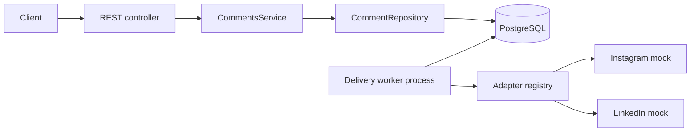

# CommentBridge

CommentBridge is a TypeScript/NestJS REST API that reads normalized comments for
a logical social-media post and sends replies through platform adapters. It covers
multi-publication reads, stable cursor pagination, parent-scoped idempotency,
delivery lifecycle tracking, RFC 7807 errors, Swagger, PostgreSQL tests, and
deterministic Instagram and LinkedIn mocks.

## Implemented requirements

- Logical `Post` records separated from per-account `PostPublication` records.
- One normalized, self-referencing `Comment` table for inbound comments and
  outbound replies.
- Reads from `PUBLISHED` publications only, with platform and direct-parent
  filters and reply counts under the same visibility rule.
- Parent-scoped idempotent replies with a database uniqueness constraint.
- Durable `PENDING` delivery jobs, leased worker claims, attempt history, bounded
  retries, and `UNKNOWN` quarantine for ambiguous outcomes.
- A standalone delivery worker process with PostgreSQL-backed heartbeat state, and
  operational delivery status, queue statistics, and database-conditional retry.
- Explicit dead-letter state and transactional audit history for manual actions.
- Platform adapter registry with deterministic Instagram and LinkedIn mocks and
  platform-specific message limits.
- RFC 7807-style errors, safe NestJS HTTP exception handling, validation details,
  request correlation IDs, and Swagger/OpenAPI.
- Unit, PostgreSQL integration, and E2E tests with an explicit destructive-reset
  guard.

## Architecture

The controller owns HTTP concerns, `CommentsService` owns workflow and invariants,
and ports isolate persistence and platform behavior. Prisma and provider details
do not cross into the public API contract.



## Runtime architecture

CommentBridge is two independently runnable processes that share only PostgreSQL:

```text
API process (node dist/main.js)          Delivery worker process (node dist/worker.js)
  Nest HTTP server                         Nest application context, no HTTP listener
  controllers, operator auth, Swagger      ReplyDeliveryWorker (claim, send, reconcile)
  CommentsService, repositories            DeliveryWorkerRuntime (register, poll, heartbeat)
  queues replies, reports queue + workers  repositories, platform adapters
            \                                       /
             +------------ PostgreSQL ------------+
               delivery queue, attempts, worker heartbeats
```

Request serving and asynchronous delivery have different lifecycles and scaling: the
API scales with traffic and must stay responsive, while the worker scales with
provider latency and is bounded by provider timeouts. The API only ever queues work;
**it never runs the worker**, so an API deployment can never start a duplicate
delivery loop by accident. `DELIVERY_WORKER_ENABLED` no longer exists (it is ignored
with a startup warning); whether a worker runs is decided only by whether you start
the worker process.

`WorkerModule` loads just the database, platform adapters, delivery repositories,
and the worker runtime: no controllers, Swagger, request middleware, or operator
authentication. `AppModule` (the API) and `WorkerModule` share the Prisma
configuration, repositories, and delivery settings through `DeliveryPersistenceModule`
but each process builds its own Prisma client and connection pool.

Run both locally (two terminals, PostgreSQL up and migrated):

```bash
pnpm dev                  # API with reload
pnpm start:worker:dev     # worker with reload
```

Production uses the compiled output and the same artifact for both:

```bash
pnpm build
pnpm start                # API:    node dist/main.js
pnpm start:worker         # worker: node dist/worker.js
```

### Production deployment

The `Dockerfile` produces one runtime image used with two commands. The Compose
file defines both, opt-in behind the `app` profile so that
`docker compose up -d postgres` still starts only the database. Name the services, since
`--profile app` alone also starts `postgres-test`:

```bash
docker compose --profile app up -d --build api delivery-worker   # runs migrate first
docker compose --profile app up -d --scale delivery-worker=3 api delivery-worker
```

`api` publishes a port and has an HTTP healthcheck. `delivery-worker` publishes no
port and has no container healthcheck: its liveness is the heartbeat reported by
`GET /api/v1/deliveries/stats`, and the restart policy covers crashes. Its
`stop_grace_period` (30s) exceeds the provider timeout so the job in flight can
finish on `SIGTERM`. Both services receive `DATABASE_URL` and the `DELIVERY_*`
settings; only the API needs `OPERATOR_API_KEYS` and `PORT`. A `migrate` job applies
migrations first from a build target that includes the Prisma CLI; the runtime image
omits dev dependencies.

## Quick start

Requirements: Node.js 22 or 24, pnpm 11, Docker, and Docker Compose.

```bash
cp .env.example .env
pnpm install
docker compose up -d postgres
pnpm db:migrate
pnpm db:seed
pnpm dev                  # API
pnpm start:worker:dev     # delivery worker, in a second terminal
```

The API only queues replies; they are delivered while the worker process runs.
PowerShell users can replace the first command with
`Copy-Item .env.example .env`. The API runs at `http://localhost:3000`, Swagger UI
at `http://localhost:3000/api/docs`, and OpenAPI JSON at
`http://localhost:3000/api/docs-json`.

The seed prints the logical post ID. Stable example IDs are:

- post: `11111111-1111-4111-8111-111111111111`
- Instagram comment: `44444444-4444-4444-8444-444444444441`
- second Instagram comment: `44444444-4444-4444-8444-444444444442`

To create a clean submission archive from committed files only:

```bash
git archive --format=zip --output=commentbridge-submission.zip HEAD
```

## API examples

List comments from published publications. Optional query parameters are
`platform`, `parentId`, `cursor`, and `limit` (default 20, maximum 100).

```bash
curl "http://localhost:3000/api/v1/posts/11111111-1111-4111-8111-111111111111/comments?platform=INSTAGRAM&limit=20"
```

Each comment exposes local and provider time:

```json
{
  "createdAt": "2026-08-04T09:00:00.000Z",
  "remoteCreatedAt": "2026-08-04T10:00:00.000Z"
}
```

`createdAt` is local persistence time. `remoteCreatedAt` is the provider timestamp
and may be `null` for `PENDING` or `FAILED` replies.

Create a reply with a key scoped to this parent comment:

```bash
curl -i -X POST \
  "http://localhost:3000/api/v1/comments/44444444-4444-4444-8444-444444444441/replies" \
  -H "Content-Type: application/json" \
  -H "Idempotency-Key: demo-reply-001" \
  -d '{"message":"Thank you for your feedback!"}'
```

A new reply is durably queued and returns `202`. A replay remains `202` while
delivery is pending and returns `200` after delivery reaches `SENT`.

The delivery operations endpoints (status, retry, dead-letter, and stats) require an
operator API key, `Authorization: Bearer <key>`; see
[Operator authentication](#operator-authentication). The examples below assume
`OPERATOR_KEY` holds a configured key.

Inspect the delivery state, its 20 most recent attempts, and its 20 most recent
manual actions:

```bash
curl "http://localhost:3000/api/v1/replies/<reply-id>/delivery" \
  -H "Authorization: Bearer $OPERATOR_KEY"
```

Conditionally schedule a failed reply for another attempt:

```bash
curl -i -X POST \
  "http://localhost:3000/api/v1/replies/<reply-id>/delivery/retry" \
  -H "Content-Type: application/json" \
  -H "Authorization: Bearer $OPERATOR_KEY" \
  -d '{"reason":"Provider incident resolved."}'
```

Retry returns `202` only for `FAILED`. Concurrent or otherwise invalid transitions
return `409`. In particular, `UNKNOWN` cannot be retried through this endpoint and
must remain on the provider-reconciliation path.

Move a queued, retrying, failed, or unknown delivery to the terminal dead-letter
state:

```bash
curl -i -X POST \
  "http://localhost:3000/api/v1/replies/<reply-id>/delivery/dead-letter" \
  -H "Content-Type: application/json" \
  -H "Authorization: Bearer $OPERATOR_KEY" \
  -d '{"reason":"Provider cannot resolve this delivery."}'
```

Manual retry and dead-letter transitions store the authenticated operator ID, the
normalized reason, previous state, resulting state, and timestamp atomically.

### Operator authentication

Operators authenticate with static API keys configured as
`OPERATOR_API_KEYS=operatorId=key[,operatorId=key]`. Each key must be at least 32
characters (`openssl rand -hex 32`), and keys and operator IDs must be unique. A
request is attributed to the operator that owns the matching key; a client-supplied
`X-Operator-Id` header is ignored. Keys are held only as SHA-256 digests, compared in
constant time, and never logged or echoed in errors. Missing, malformed, or unknown
credentials all return the same `401` problem response with
`WWW-Authenticate: Bearer`.

The endpoints fail closed: with `OPERATOR_API_KEYS` empty, every operations request is
rejected (a startup warning says so), and malformed settings stop startup. Comment
and reply endpoints and `/health` stay open. This is deliberately not user
authentication or tenant authorization: there are no roles, per-endpoint scopes, or
key rotation workflow. Rotate by adding the new key, deploying, then removing the
old one.

## Database model

`Post` is platform-neutral content. `PostPublication` represents delivery to one
`SocialAccount` and owns the platform post ID and status. Inbound comments and
outbound replies share `Comment`; `parentId` links a reply to its direct parent.

PostgreSQL constraints enforce account/publication uniqueness, external-comment
uniqueness per publication, reply idempotency per parent, valid direction/delivery
combinations, and a parent for every outbound reply. The application always
derives a reply's `postPublicationId` from the loaded parent, while a composite
foreign key on `(parentId, postPublicationId)` prevents every database writer from
linking comments across publications. Additional checks require provider identity
for inbound and sent comments and keep publication status aligned with
`publishedAt`.

Reads order by `COALESCE(remoteCreatedAt, createdAt), id`. Matching SQL expression
indexes live in migrations because Prisma cannot represent them; required
uniqueness indexes remain.

## Platform adapter extension

`SocialPlatformAdapter` contains platform identity, capabilities, reply delivery,
and authoritative reply lookup. Tests use Jest spies rather than adding
instrumentation to the port.

To add a platform:

1. Add its domain and Prisma enum value with a migration.
2. Implement the adapter, capabilities, and safe provider-error mapping.
3. Register the adapter in `PlatformsModule`.

No platform-specific branch is needed in `CommentsService`.

## Idempotency

The database unique key is `(parentId, idempotencyKey)`, and every lookup uses the
same pair. The same key and normalized message on the same parent returns the
stored reply without calling the provider again; a different message returns
`409`. The same key can be used independently on another parent. The unique index
closes concurrent-create races, so only one durable delivery job is created. A
concurrent duplicate request receives the existing `PENDING` reply with `202`.
After successful delivery, the same request is returned as an idempotent `200`
replay.

The worker claims due jobs with `FOR UPDATE SKIP LOCKED` and a lease. Explicitly
retryable provider failures use bounded exponential backoff and reuse the same
provider idempotency key. Unknown exceptions, timeouts, expired leases, and a crash
after provider acceptance are quarantined as delivery `UNKNOWN`; the public reply
remains `PENDING` until provider lookup resolves it. A found reply completes the
original attempt, an authoritative absence permits bounded retry, and an
inconclusive lookup remains quarantined with backoff. Exactly-once delivery still
depends on provider-side idempotency and authoritative reconciliation support.

## Worker lease ownership

Every claim (normal delivery or `UNKNOWN` reconciliation) stamps the delivery with a
fresh random `leaseToken` next to `leaseUntil`, and returns it in the work item.
Every completion (`SUCCEEDED`, `RETRY`, `FAILED`, `UNKNOWN`) is a single
conditional update on `id`, `status = PROCESSING`, the attempt number, **and the
exact token**, and clears the lease and token when it leaves `PROCESSING`.

The token matters because a lease can expire, be reconciled to `UNKNOWN`, and be
re-claimed for lookup under the _same attempt number_. Status and attempt number
alone would then match the new owner, letting a stalled worker overwrite its
result. A stale worker now fails with an internal `DeliveryLeaseLostError`
before any delivery, comment, or attempt row changes; the worker logs it and
discards the result. The new owner's provider lookup finds a reply the stale
worker really sent, so it is still delivered once. The token is never exposed by
the API. PostgreSQL enforces that `PROCESSING` rows have both `leaseUntil` and
`leaseToken`, and all other states have neither.

`reconcileExpiredLeases` is one SQL statement that moves only rows that are still
`PROCESSING` and expired, closes their open attempt, and returns the number
actually transitioned. A provider lookup during reconciliation is not a new
outbound attempt, so `attemptCount` is unchanged.

## Worker scheduling and lifecycle

Each poll runs one bounded drain: expired-lease maintenance once, then up to
`DELIVERY_MAX_JOBS_PER_TICK` jobs. `UNKNOWN` reconciliation gets up to
`DELIVERY_MAX_RECONCILIATIONS_PER_TICK` slots first and normal `PENDING`/`RETRY`
deliveries get the remainder, so a large `UNKNOWN` backlog cannot starve fresh
replies. A slot one queue does not use goes to the other. Every job takes a fresh
clock reading, so a lease never starts in the past. (Keep the reconciliation quota
below the job budget to guarantee normal deliveries a slot every tick.)

The worker process starts with `NestFactory.createApplicationContext` (no HTTP
listener), registers itself, then polls and heartbeats until it receives a signal.
A fatal startup error (invalid configuration, database unreachable) exits non-zero.

On `SIGTERM` or `SIGINT` the runtime stops the poll and heartbeat timers, starts no
further jobs, and waits for the job already in flight (bounded by the provider
timeout) before the database connection closes and the process exits. A second signal
exits immediately. A hard kill is still safe: the unfinished lease expires into
`UNKNOWN` and is resolved by provider lookup. Shutdown writes nothing to shared
state; the worker simply goes `STALE` when its heartbeat ages out.

| Variable                                | Default | Meaning                                                                 |
| --------------------------------------- | ------- | ----------------------------------------------------------------------- |
| `DELIVERY_POLL_INTERVAL_MS`             | `1000`  | Delay between drains                                                    |
| `DELIVERY_LEASE_DURATION_MS`            | `30000` | Must exceed the provider timeout                                        |
| `DELIVERY_PROVIDER_TIMEOUT_MS`          | `10000` | Per provider call or lookup                                             |
| `DELIVERY_MAX_ATTEMPTS`                 | `5`     | Attempts before `FAILED`                                                |
| `DELIVERY_BASE_RETRY_DELAY_MS`          | `1000`  | First backoff; doubles per attempt                                      |
| `DELIVERY_MAX_RETRY_DELAY_MS`           | `60000` | Backoff cap; at least the base delay                                    |
| `DELIVERY_MAX_JOBS_PER_TICK`            | `10`    | Jobs per drain                                                          |
| `DELIVERY_MAX_RECONCILIATIONS_PER_TICK` | `3`     | Reconciliation slots; at most the job budget                            |
| `DELIVERY_WORKER_HEARTBEAT_INTERVAL_MS` | `10000` | How often a worker refreshes its heartbeat                              |
| `DELIVERY_WORKER_STALE_AFTER_MS`        | `30000` | Heartbeat age after which a worker is `STALE`; must exceed the interval |

Invalid values stop startup of the API and the worker with an error naming the
variable (never its value). The API reads `DELIVERY_WORKER_STALE_AFTER_MS` to classify
workers, so give both processes the same value.

## Delivery observability

`GET /api/v1/deliveries/stats` is a read-only operations view with two parts, both
read from PostgreSQL. It requires an operator API key like the other operations
endpoints.

- `queue`: durable, cross-instance state from one SQL statement: row counts for
  every delivery status, how long the oldest _due_ `PENDING`/`RETRY` delivery
  (`oldestDueDeliveryAgeMs`) and the oldest due `UNKNOWN` delivery
  (`oldestDueReconciliationAgeMs`) have waited, and `expiredLeases`, the
  `PROCESSING` rows past their lease that maintenance has not yet reconciled.
  Rising lag or a persistent `expiredLeases` means workers are down or behind.
- `workers`: the state of every worker process, shared through the
  `DeliveryWorkerInstance` table. Worker counters used to live in the memory of the
  process serving the request; once the worker became its own process the API could
  only have reported zeros, so that model was replaced rather than kept.

```json
{
  "queue": { "countsByStatus": { "PENDING": 0 }, "expiredLeases": 0, "...": "..." },
  "workers": {
    "staleAfterMs": 30000,
    "active": 1,
    "stale": 0,
    "instances": [
      {
        "instanceId": "worker-host-41-9f3a1c2e",
        "status": "ACTIVE",
        "startedAt": "2026-10-03T12:00:00.000Z",
        "lastHeartbeatAt": "2026-10-03T12:05:08.000Z",
        "lastDrain": {
          "completedAt": "2026-10-03T12:04:59.000Z",
          "durationMs": 18,
          "processed": 4,
          "succeeded": 3,
          "retry": 1,
          "failed": 0,
          "unknown": 0,
          "leaseLost": 0,
          "expiredLeases": 0
        }
      }
    ]
  }
}
```

**Worker runtime state.** Each worker process generates an `instanceId` once at
startup (host, pid, random suffix) and keeps one row for its lifetime, so any number
of workers coexist without sharing a row. The id is only for operators; it is
unrelated to a delivery's `leaseToken`, which protects ownership of one delivery and
is never exposed. A worker registers on startup and then refreshes
`lastHeartbeatAt` every `DELIVERY_WORKER_HEARTBEAT_INTERVAL_MS` from a timer that is
independent of the poll loop, so a slow provider call does not look like a dead
worker. A drain is persisted only when it did work (a delivery, a reconciliation, or
expired-lease maintenance); idle polls cost no writes, so `lastDrain` is the most
recent drain that did something, and an old `lastDrain` beside a fresh heartbeat
means an idle queue.

**ACTIVE and STALE.** A worker is `ACTIVE` while its last heartbeat is at most
`DELIVERY_WORKER_STALE_AFTER_MS` old and `STALE` afterwards. Heartbeat age is the only
source of truth: a crashed process cannot record that it stopped, so there is no
`STOPPED` state and a graceful shutdown just ages out. Timestamps come from each
process clock, so keep host clocks roughly synchronized (skew must stay well below
the stale threshold). Zero `active` workers with growing `queue` lag means nothing
is delivering.

Rows whose heartbeat is older than the retention window (24 hours, or twice the
stale threshold if larger) are not reported and are pruned when any worker starts.
That is the only cleanup; it keeps the table at roughly one row per recent restart
until the general retention task covers delivery history. The `instances` list is
capped at the 50 most recent heartbeats while `active` and `stale` count every row.

Inside the worker process, `DeliveryWorkerMetrics` still keeps per-process counters
(drains, drain failures, job outcomes by kind). They are not exposed through the API
because they describe one process only; the worker logs its drain and failure totals
at shutdown.

A drain that did any work also writes one JSON log line
(`{"event":"delivery.drain","durationMs":…,"expiredLeases":…,"reconciled":…,"delivered":…}`);
idle drains are silent. The worker logs `delivery-worker.starting`,
`delivery-worker.started`, `delivery-worker.shutdown-started`, and
`delivery-worker.shutdown-complete` with its `workerInstanceId`; heartbeats are not
logged. Messages, provider payloads, and credentials are never logged.

## Pagination

Pages use descending keyset pagination over effective creation time and UUID. An
opaque base64url cursor contains that validated tuple, avoiding growing offset
cost and page shifts from newer rows. Local `createdAt` is the deterministic
fallback when provider time is absent.

## Errors

Errors use `application/problem+json` with `type`, `title`, `status`, `detail`,
`code`, and `requestId`. Validation errors may include safe field messages, and
provider failures may include `replyId` and `retryable`. NestJS exceptions preserve
their HTTP status with safe text. Stack traces and raw framework, database, or
provider details are never returned.

Every response includes or echoes `X-Request-Id`.

## Testing

Unit tests require no services:

```bash
pnpm test
```

Integration and E2E suites use a disposable `commentbridge_test` database and load
only `.env.test.example`. Before any `deleteMany()`, the guard requires
`NODE_ENV=test` and a database name ending in `_test`; unsafe settings are refused
without exposing the connection URL.

```bash
docker compose up -d postgres-test
pnpm db:test:migrate
pnpm test:integration
pnpm test:e2e
```

Complete local validation:

```bash
pnpm format:check
pnpm lint
pnpm typecheck
pnpm test
docker compose config
docker compose up -d postgres-test
pnpm db:test:migrate
pnpm test:integration
pnpm test:e2e
pnpm build
git diff --check
```

## Assumptions and trade-offs

- Authentication, authorization, OAuth, and real provider credentials are outside
  the assignment scope.
- Posts, accounts, publications, and synchronized inbound comments already exist
  in PostgreSQL as the normalized read model.
- The API returns a bounded flat list rather than recursively expanding threads.
- Mock adapters are deterministic and make no external requests.
- Outbound jobs are polled by a separate worker process (`pnpm start:worker`), never
  by the API. Operational limits are environment variables (see above).
- Parent/publication consistency and delivery-field invariants are enforced by
  PostgreSQL as well as the application workflow.

See [docs/DECISIONS.md](docs/DECISIONS.md) for the engineering decisions.

## Production evolution

The durable delivery state machine, provider lookup reconciliation, delivery status,
conditional manual retry, dead-letter controls, and manual-action audit trail are
implemented. Operator API-key authentication, the standalone worker process, and
PostgreSQL-backed worker heartbeats are implemented. Production evolution should
add a
retention policy for finished deliveries and attempt history, and an external
identity provider in place of static keys. Inbound sync could add authenticated
webhooks or polling. Tenant authorization, encrypted provider credentials,
throttling, and metrics export should follow concrete operational requirements.

## AI-assisted development

I designed the solution and made the final engineering decisions with AI-assisted
support. Claude was used as a collaborator during the initial architecture and
design phase, GitHub Copilot assisted me with implementation, and Codex assisted
with the code review.

I reviewed, adapted, tested, and validated all submitted code and remain fully
responsible for the implementation and its engineering decisions.
