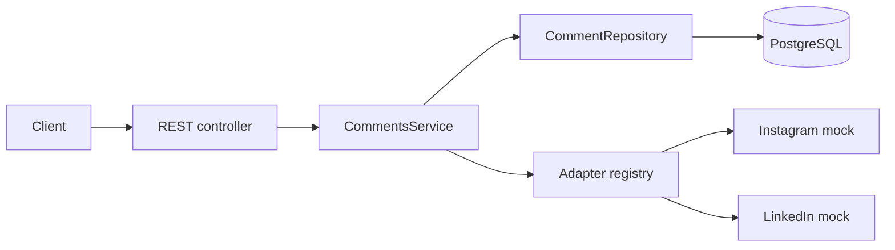

# CommentBridge

CommentBridge is a TypeScript/NestJS REST API that reads normalized comments for
a logical social-media post and sends replies through platform adapters. It covers
multi-publication reads, stable cursor pagination, parent-scoped idempotency,
delivery lifecycle tracking, RFC 7807 errors, Swagger, PostgreSQL integration
tests, and deterministic Instagram and LinkedIn mocks.

To run it: copy `.env.example` to `.env`, run `pnpm install`, start PostgreSQL with
`docker compose up -d postgres`, then run `pnpm db:migrate`, `pnpm db:seed`, and
`pnpm dev`.

## Implemented requirements

- Logical `Post` records separated from per-account `PostPublication` records.
- One normalized, self-referencing `Comment` table for inbound comments and
  outbound replies.
- Reads from `PUBLISHED` publications only, with platform and direct-parent
  filters and reply counts under the same visibility rule.
- Parent-scoped idempotent replies with a database uniqueness constraint.
- `PENDING` → `SENT`/`FAILED` outbound lifecycle; no provider call in a long
  database transaction.
- Platform adapter registry with deterministic Instagram and LinkedIn mocks and
  platform-specific message limits.
- RFC 7807-style errors, safe NestJS HTTP exception handling, validation details,
  request correlation IDs, and Swagger/OpenAPI.
- Unit, PostgreSQL integration, and E2E tests with an explicit destructive-reset
  guard.

## Architecture

The controller owns HTTP concerns, `CommentsService` owns workflow and invariants,
and ports isolate persistence and social-platform behavior. Prisma and mock-provider
details do not cross into the public API contract.



A reply is first committed locally as `PENDING`. The adapter is called without an
open database transaction, after which the reply becomes `SENT` or `FAILED`.

## Quick start

Requirements: Node.js 22 or 24, pnpm 11, Docker, and Docker Compose.

```bash
cp .env.example .env
pnpm install
docker compose up -d postgres
pnpm db:migrate
pnpm db:seed
pnpm dev
```

PowerShell users can replace the first command with
`Copy-Item .env.example .env`. The API runs at `http://localhost:3000`, Swagger UI
at `http://localhost:3000/api/docs`, and OpenAPI JSON at
`http://localhost:3000/api/docs-json`.

The seed prints the logical post ID. Its stable example IDs are:

- post: `11111111-1111-4111-8111-111111111111`
- Instagram comment: `44444444-4444-4444-8444-444444444441`
- second Instagram comment: `44444444-4444-4444-8444-444444444442`

To create a clean submission archive from committed files only:

```bash
git archive --format=zip --output=commentbridge-submission.zip HEAD
```

## API examples

List comments from published publications. Optional query parameters are
`platform`, `parentId`, `cursor`, and `limit` (default 20, maximum 100).

```bash
curl "http://localhost:3000/api/v1/posts/11111111-1111-4111-8111-111111111111/comments?platform=INSTAGRAM&limit=20"
```

Each comment exposes local and provider time explicitly:

```json
{
  "createdAt": "2026-08-04T09:00:00.000Z",
  "remoteCreatedAt": "2026-08-04T10:00:00.000Z"
}
```

`createdAt` is always local record creation time. `remoteCreatedAt` is the
provider timestamp and may be `null` for `PENDING` or `FAILED` outbound replies.

Create a reply with a key scoped to this parent comment:

```bash
curl -i -X POST \
  "http://localhost:3000/api/v1/comments/44444444-4444-4444-8444-444444444441/replies" \
  -H "Content-Type: application/json" \
  -H "Idempotency-Key: demo-reply-001" \
  -d '{"message":"Thank you for your feedback!"}'
```

A new reply returns `201`; an identical replay returns `200` and `replayed: true`.

## Database model

`Post` is platform-neutral content. A `PostPublication` represents its delivery to
one `SocialAccount` and owns the platform post ID and publication status. Inbound
comments and outbound replies share `Comment`; `parentId` links a reply to its
direct parent.

PostgreSQL constraints enforce account/publication uniqueness, external-comment
uniqueness per publication, reply idempotency per parent, valid direction/delivery
combinations, and a parent for every outbound reply. The application always
derives a reply's `postPublicationId` from the loaded parent. Direct database
writers must also preserve the same-parent/same-publication invariant because
Prisma cannot express that cross-row relationship without a more complex composite
foreign key.

The read query orders by `COALESCE(remoteCreatedAt, createdAt), id`. Matching SQL
expression indexes live in the migration because Prisma cannot represent them.
Ordinary compound timestamp indexes were omitted after comparison with the actual
query; required uniqueness and expression indexes remain.

## Platform adapter extension

`SocialPlatformAdapter` contains only production behavior: platform identity,
capabilities, and `replyToComment`. Test call assertions use Jest spies rather than
adding counters to the port.

To add a platform:

1. Add its domain and Prisma enum value with a migration.
2. Implement the adapter, capabilities, and safe provider-error mapping.
3. Register the adapter in `PlatformsModule`.

No platform-specific branch is needed in `CommentsService`.

## Idempotency

The database unique key is `(parentId, idempotencyKey)`, and every lookup uses the
same pair. The same key and normalized message on the same parent returns the
stored reply without calling the provider again; a different message returns
`409`. The same key can be used independently on another parent. The unique index
also closes concurrent-create races, so only the winning request calls the
adapter.

This is local at-most-one provider call during normal process execution, not a
claim of distributed exactly-once delivery. A crash after provider acceptance but
before `SENT` is stored can leave an ambiguous `PENDING` record.

## Pagination

Pages use descending keyset pagination over effective creation time and UUID. The
opaque base64url cursor contains that validated tuple. This avoids growing offset
cost and prevents new rows ahead of a cursor from shifting later pages. Cursor
behavior remains deterministic when provider time is absent because local
`createdAt` is the fallback.

## Errors

Errors use `application/problem+json` with `type`, `title`, `status`, `detail`,
`code`, and `requestId`. Validation errors may include safe field messages;
provider failures may include `replyId` and `retryable`. Custom application errors
retain their mappings, while ordinary NestJS exceptions preserve their HTTP status
with generic safe text. Stack traces, raw framework/database/provider details, and
credentials are never returned.

Every response includes or echoes `X-Request-Id`.

## Testing

Unit tests require no services:

```bash
pnpm test
```

Integration and E2E suites use the dedicated `commentbridge_test` database. The
Compose service stores its data in a disposable `tmpfs`; the scripts load only
`.env.test.example`. Before any `deleteMany()`, the guard requires both
`NODE_ENV=test` and a database name ending in `_test`. It refuses unsafe settings
without printing the connection URL or credentials.

```bash
docker compose up -d postgres-test
pnpm db:test:migrate
pnpm test:integration
pnpm test:e2e
```

Complete local validation:

```bash
pnpm format:check
pnpm lint
pnpm typecheck
pnpm test
pnpm test:integration
pnpm test:e2e
pnpm build
docker compose config
git diff --check
```

## Assumptions and trade-offs

- Authentication, authorization, OAuth, and real provider credentials are outside
  the assignment scope.
- Posts, accounts, publications, and synchronized inbound comments already exist;
  reads use PostgreSQL as the normalized local read model.
- The API returns a bounded flat list rather than recursively expanding threads.
- Mock adapters are deterministic and make no external requests.
- Synchronous outbound delivery is concise and observable but has the crash window
  described under idempotency. Failed rows are not retried automatically.
- Parent/publication consistency is enforced by the only application write path;
  direct database writers must preserve it.

See [docs/DECISIONS.md](docs/DECISIONS.md) for concise engineering decisions and
[FINAL_REVIEW_PLAN.md](FINAL_REVIEW_PLAN.md) for the verified final-review scope.

## Production evolution

These items are not implemented. If product requirements justify them, outbound
delivery could evolve to a transactional outbox and retrying worker with provider
idempotency and reconciliation. Inbound synchronization could add authenticated
webhooks or polling. Tenant authorization, encrypted provider credentials,
throttling, tracing/metrics, and retention policies should follow concrete
operational requirements.

## AI-assisted development

I designed the solution and made the final engineering decisions with AI-assisted
support. Claude was used as a collaborator during the initial architecture and
design phase, GitHub Copilot assisted with implementation, and ChatGPT assisted
with the final architecture and code review.

I reviewed, adapted, tested, and validated all submitted code and remain fully
responsible for the implementation and its engineering decisions.
