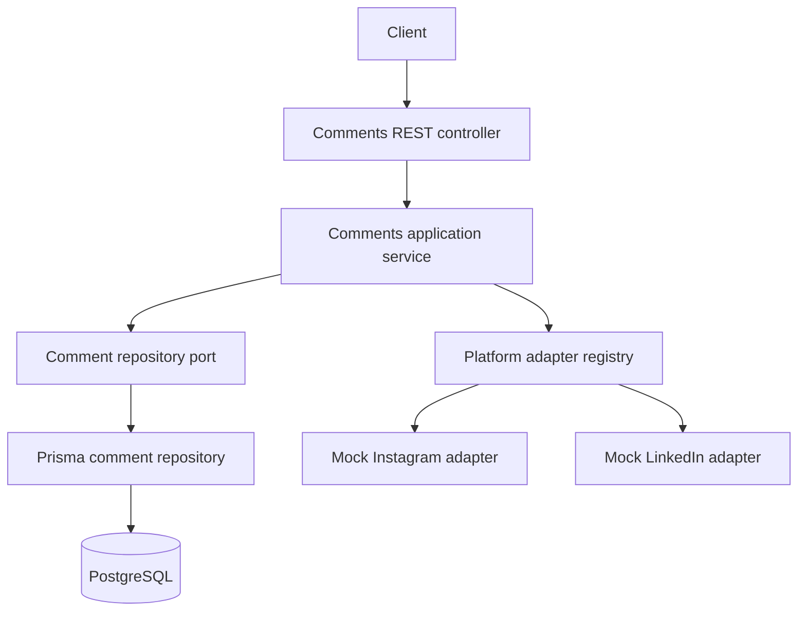
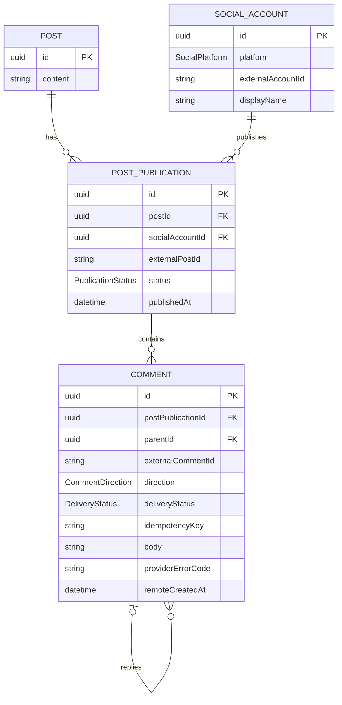

# Social Comments API

A production-minded NestJS/TypeScript backend for reading normalized comments
on a logical social post and replying through platform adapters. The solution is
intentionally one application and one PostgreSQL database: enough structure to
make boundaries and failure behavior explicit without speculative infrastructure.

The seeded post ID is `11111111-1111-4111-8111-111111111111` and the seeded
Instagram comment ID is `44444444-4444-4444-8444-444444444441`.

## Architecture

The application follows pragmatic ports and adapters. The controller owns HTTP
concerns, the application service owns workflow and invariants, and infrastructure
implements persistence and provider contracts. No Prisma or provider SDK types
cross into the controller contract.



The service creates and commits a local `PENDING` reply, calls the provider with
no transaction held open, then marks the row `SENT` or `FAILED`.

## Data model



`Post` is the platform-neutral scheduled content. Each `PostPublication` is one
delivery to one social account and carries the provider post ID. Inbound comments
and outbound replies share a normalized, self-referencing table. PostgreSQL
constraints enforce account/publication, external-comment, and idempotency
uniqueness. A check constraint permits `RECEIVED` only for inbound rows and
`PENDING`/`SENT`/`FAILED` only for outbound rows. SQL expression indexes support
the effective-timestamp keyset query; these are migration-only because Prisma's
schema language does not represent expression indexes.

Prisma cannot express “the parent comment belongs to the same publication” as a
relational constraint. The application loads the parent with its publication,
checks the IDs, and creates the reply using that publication ID. This invariant
is called out explicitly because direct database writers must preserve it too.

## Setup and local commands

Requirements: Node.js 22 (Node 24 is also accepted by `engines`), pnpm 11, Docker,
and Docker Compose.

```bash
cp .env.example .env
pnpm install
docker compose up -d
pnpm db:migrate
pnpm db:seed
pnpm dev
```

On PowerShell, use `Copy-Item .env.example .env` instead of `cp`. The API starts
at `http://localhost:3000`, Swagger UI at `http://localhost:3000/api/docs`, and
OpenAPI JSON at `http://localhost:3000/api/docs-json`.

All supported scripts:

```bash
pnpm dev
pnpm build
pnpm start
pnpm lint
pnpm format:check
pnpm typecheck
pnpm test
pnpm test:integration
pnpm test:e2e
pnpm db:migrate
pnpm db:seed
pnpm db:reset
```

Integration and E2E tests intentionally require the disposable local PostgreSQL
container and an applied migration. They reset and reseed the configured database;
do not point `DATABASE_URL` at data you care about.

## API

`GET /health` returns application/database readiness without configuration or
credentials.

`GET /api/v1/posts/:postId/comments` accepts optional `platform`, `parentId`,
opaque `cursor`, and `limit` (default 20, maximum 100). Omitting `parentId`
returns a normalized flat list including both top-level comments and replies.

```bash
curl "http://localhost:3000/api/v1/posts/11111111-1111-4111-8111-111111111111/comments?platform=INSTAGRAM&limit=20"
```

`POST /api/v1/comments/:commentId/replies` requires a client-generated
`Idempotency-Key` and JSON message.

```bash
curl -i -X POST \
  "http://localhost:3000/api/v1/comments/44444444-4444-4444-8444-444444444441/replies" \
  -H "Content-Type: application/json" \
  -H "Idempotency-Key: demo-reply-001" \
  -d '{"message":"Thank you for your feedback!"}'
```

A new successful reply is `201`; replaying the same key and normalized message is
`200`. Reusing a key with a different message is `409`. Validation, missing
resources, unpublished publications, rate limiting, and provider failures use
`application/problem+json`. Each response includes/echoes `X-Request-Id`; each
problem includes that ID. Stack traces, raw database errors, raw provider bodies,
and credentials are never returned.

## Idempotency and delivery

Idempotency is scoped to a publication with a unique
`(postPublicationId, idempotencyKey)` index. The service first reads an existing
row and the repository also converts a concurrent uniqueness race into a replay,
so only the winner can call the mock provider. The message must match the original
request. Successful replays return the stored reply. A replay of a failed attempt
returns its safe failure and reply ID; a `PENDING` replay returns a conflict because
the outcome is not yet known.

This prevents duplicate local work and duplicate calls in a running process, but
does not claim distributed exactly-once delivery. A crash after the provider
accepts a reply but before `SENT` is stored leaves an ambiguous `PENDING` record.
Production would combine provider-native idempotency, a transactional outbox,
background retries with backoff, and reconciliation against provider state.

## Pagination

Pages sort descending by `COALESCE(remoteCreatedAt, createdAt)` and UUID as a
tie-breaker. The cursor is a base64url-encoded, validated JSON tuple containing
that timestamp and ID. Queries use keyset predicates, not offsets, so page cost
does not grow with page number and inserts ahead of the cursor do not shift later
pages. The cursor is opaque API data, not a stable client storage format.

## Platform adapters

Instagram and LinkedIn mocks implement the same `SocialPlatformAdapter` port.
They have different reply-length limits, deterministic external IDs, call counters,
and no network access. `[test:provider-unavailable]` and `[test:rate-limit]` are
documented deterministic failure messages isolated to these mocks.

To add a platform:

1. Add the platform enum value in the domain and Prisma schema plus a migration.
2. Implement `SocialPlatformAdapter`, including capabilities and safe error mapping.
3. Register it in `PlatformsModule`.

The comment service requires no platform-specific branch.

## Test strategy

Unit tests mock repository and adapter ports at the service boundary and exercise
workflow, capabilities, replay, failure, invariants, registry behavior, and cursor
codec behavior. Integration tests use PostgreSQL to exercise migrations,
constraints, multi-publication reads, filters, reply counts, stable keyset pages,
success/failure persistence, and uniqueness. E2E tests exercise the real Nest
validation/filter/controller stack for both endpoints, replay status codes,
provider errors, invalid input, and missing comments. Every provider is deterministic
and local.

## Assumptions

- Authentication and authorization are outside the take-home scope.
- Social accounts and published posts already exist.
- External comments have already been synchronized into the normalized database.
- Reads come from the local database; adapters demonstrate outbound integration.
- Mock adapters replace real platform APIs and no credentials are stored.
- Replies are self-referencing `Comment` records.
- Pagination is a flat list, not an unbounded recursive tree.
- Provider tokens and OAuth flows are outside scope.
- Production inbound synchronization would use webhooks and/or polling.
- Production outbound delivery would likely use an outbox and worker.

## Trade-offs and known limitations

The outbound call is synchronous for an honest, small take-home API. It makes the
success response useful but cannot close the crash window described above. Failed
rows are not retried automatically. The database check constraint is supplied in
SQL because Prisma cannot represent it. Parent/publication consistency is an
application invariant rather than a database constraint. Cursor order is stable,
but rows updated between page requests can still reflect normal read-committed
concurrency. The mocks do not model authentication, edits, deletes, webhook races,
or provider-specific thread depth. There is no auth, rate limiter, tracing backend,
or production secret management.

## Production evolution

The next step would be transactional creation of the reply plus an outbox event,
then a worker with bounded retries, exponential backoff, dead-letter visibility,
provider idempotency keys, and reconciliation for ambiguous results. Inbound
webhooks/polling would upsert provider comments into the same normalized read
model. Add tenant-aware authorization, encrypted provider credentials, operational
metrics/traces, per-account throttling, deployment migrations, and retention/audit
policies as product requirements become concrete.

See [docs/DECISIONS.md](docs/DECISIONS.md) for concise decision records and
[IMPLEMENTATION_PLAN.md](IMPLEMENTATION_PLAN.md) for the delivery plan.

## AI usage disclosure

AI tools were used to assist with initial scaffolding, test-case generation, and
code review. All architectural decisions, implementation details, and generated
changes were reviewed and validated by the author.
